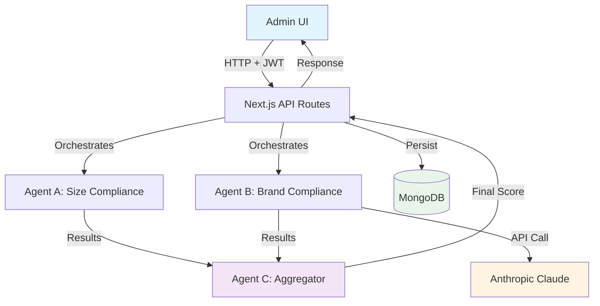
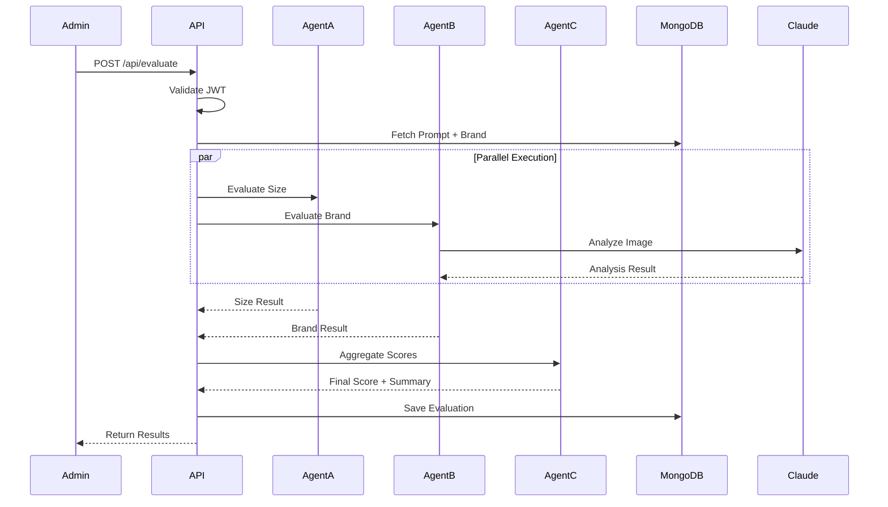
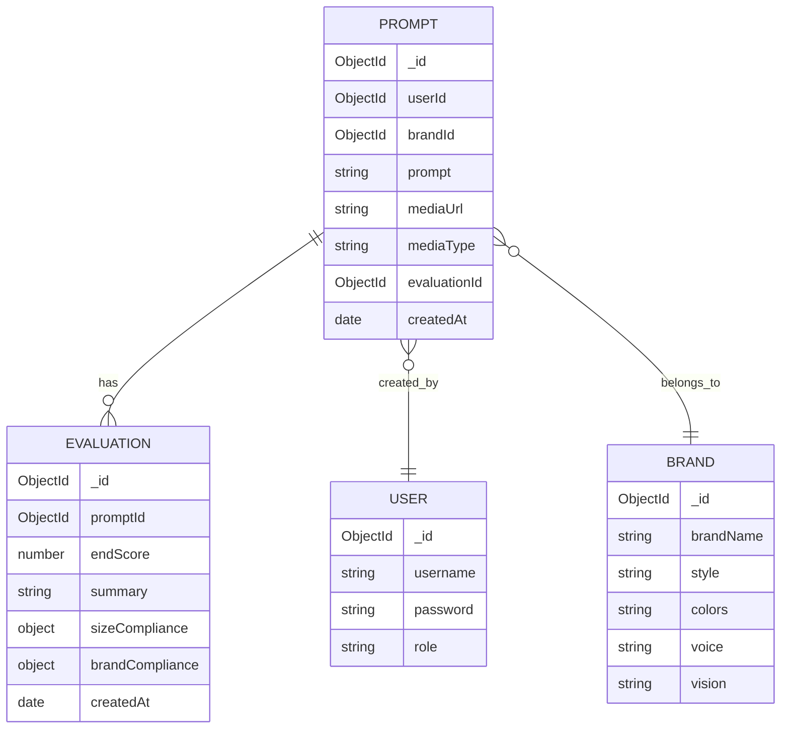

# Architecture Documentation

## Overview

An admin dashboard for evaluating user-generated images against brand guidelines and platform requirements using a multi-agent AI system.

**Tech Stack:** Next.js, MongoDB, Anthropic Claude, TypeScript

---

## System Architecture



---

## Multi-Agent System

### Agent Responsibilities

| Agent                         | Type          | Input                                 | Output                                                                                           | Rationale                                                            |
| ----------------------------- | ------------- | ------------------------------------- | ------------------------------------------------------------------------------------------------ | -------------------------------------------------------------------- |
| **Agent A: Size Compliance**  | Deterministic | Image metadata, platform requirements | `score`, `reasoning`, `isOptimal`                                                                | Rule-based checks are fast, testable, and cost-effective             |
| **Agent B: Brand Compliance** | LLM (Claude)  | Image (base64), prompt, brand details | `score`, `styleAlignment`, `colorCompliance`, `voiceConsistency`, `visionAlignment`, `reasoning` | Brand alignment requires semantic understanding and visual reasoning |
| **Agent C: Aggregator**       | Deterministic | Agent A + B outputs                   | `endScore`, `summary`                                                                            | Ensures reproducible scoring with configurable weights               |

### Orchestration Flow



**Execution Strategy:** Agents run in parallel using `Promise.all()` to minimize latency.

---

## Data Model

### Collections



### Evaluation Schema

| Field             | Type          | Description                                                                                                         |
| ----------------- | ------------- | ------------------------------------------------------------------------------------------------------------------- |
| `promptId`        | ObjectId      | Reference to evaluated prompt                                                                                       |
| `endScore`        | Number (0-10) | Final weighted score                                                                                                |
| `summary`         | String        | Brief assessment                                                                                                    |
| `sizeCompliance`  | Object        | `{ score, reasoning, isOptimal }`                                                                                   |
| `brandCompliance` | Object        | `{ score, styleAlignment, colorCompliance, voiceConsistency, visionAlignment, reasoning, strengths, improvements }` |
| `createdAt`       | Date          | Evaluation timestamp                                                                                                |

**Why store per-agent outputs?**

- Auditability for brand teams
- Debugging LLM variations
- Historical analysis and reporting

---

## Key Files

```
app/
├── admin/
│   ├── page.tsx                    # Main admin dashboard
│   └── components/
│       ├── PromptModal.tsx         # Evaluation results display
│       └── MediaThumbnail.tsx      # Image/video preview
├── api/
│   ├── evaluate/route.ts           # Orchestration endpoint
│   ├── prompts/route.ts            # List & filter prompts
│   └── login/route.ts              # JWT authentication
agents/
├── sizeCompliance.ts               # Agent A
├── brandCompliance.ts              # Agent B
└── aggregator.ts                   # Agent C
lib/
├── anthropic.ts                    # Claude API wrapper
├── auth.ts                         # JWT utilities
└── parseClaudeResponse.ts          # JSON extraction
models/
├── Prompt.ts
├── Evaluation.ts
├── Brand.ts
└── User.ts
```

---

## Trade-offs & Decisions

### 1. LLM vs. Heuristics

| Criterion         | Approach         | Reason                                               |
| ----------------- | ---------------- | ---------------------------------------------------- |
| Size compliance   | **Heuristics**   | Rule-based, fast, deterministic, cost-effective      |
| Brand compliance  | **LLM (Claude)** | Requires semantic understanding and visual reasoning |
| Score aggregation | **Heuristics**   | Reproducible, configurable weights                   |

### 2. Orchestration

**Decision:** Manual orchestration with `Promise.all()`

**Pros:**

- Simple, explicit, no external dependencies
- Easy to understand and debug
- Appropriate for project scope

**Cons:**

- No built-in retry/observability
- Manual error handling

**Alternative Considered:** Workflow engines (LangGraph, Temporal) — rejected as over-engineering for this scope.

### 3. Image Compression

**Challenge:** Claude has a 5MB limit for base64 images

**Solution:** Use Sharp library to compress images >4.5MB

- Resize to max 2048x2048
- Convert to JPEG with 85% quality
- Preserves enough detail for AI analysis

### 4. Video Evaluation

**Decision:** Deferred to future iteration

**Reasoning:**

- Time constraint (4-hour assignment limit)
- Requires ffmpeg setup and frame extraction
- Images represent majority use case
- Architecture supports future extension

**Future Implementation:**

```
Video → Extract 6-8 frames → Process as images → Aggregate results
```

### 5. Caching

**Decision:** No caching implemented

**Reasoning:**

- Evaluations are stored in MongoDB (acts as result cache)
- Re-evaluations are intentionally allowed for updated brand guidelines
- LLM responses may vary; storing raw outputs is more valuable

---

## Scoring Formula

```typescript
endScore =
  sizeCompliance.score * 0.2 + // 20% weight
  brandCompliance.score * 0.8; // 80% weight (more critical)

// Rounded to 1 decimal place
```

**Rationale:** Brand alignment is more critical than sizing (which can be easily fixed in post-production).

---

## Local Setup

### Prerequisites

- Node.js 18+
- MongoDB instance
- Anthropic API key

### Quick Start

```bash
# 1. Install dependencies
npm install

# 2. Configure environment
cp .env.example .env.local
# Edit .env.local with your credentials

# 3. Seed database
npm run import-data

# 4. Start development server
npm run dev

# 5. Login at http://localhost:3000
# Username: admin
# Password: test
```

### Environment Variables

| Variable            | Required | Description                           |
| ------------------- | -------- | ------------------------------------- |
| `MONGODB_URI`       | Yes      | MongoDB connection string             |
| `ANTHROPIC_API_KEY` | Yes      | Claude API key                        |
| `JWT_SECRET`        | Yes      | Secret for JWT signing                |
| `NEXTAUTH_URL`      | No       | Base URL (defaults to localhost:3000) |

---

## Known Limitations

⚠️ **Development-Only Features:**

- Plaintext passwords in seed data
- Simplified JWT implementation
- No rate limiting or request throttling

⚠️ **Functional Limitations:**

- Video evaluation not implemented (frame extraction pending)
- No retry logic for failed API calls
- No caching layer for LLM responses

⚠️ **Scale Considerations:**

- Sequential processing (no job queue)
- All evaluations run synchronously
- No distributed agent execution

---

## Future Enhancements

1. **Video Support:** Extract frames using fluent-ffmpeg
2. **Batch Evaluation:** Queue-based processing for multiple prompts
3. **Caching:** Redis layer for LLM responses
4. **Observability:** Logging, tracing, and monitoring
5. **Advanced Scoring:** ML-based weight optimization
6. **User Management:** Proper authentication with password hashing

---

## Testing the System

### Manual Testing Flow

1. Navigate to `/admin` and login
2. Click any prompt card to view details
3. Click "Evaluate" button
4. Observe loading state
5. Review per-criterion scores and reasoning
6. Check MongoDB for persisted evaluation

### Expected Results

- Size compliance: 0-10 score based on dimensions
- Brand compliance: Multi-dimensional scoring (style, color, voice, vision)
- End score: Weighted average displayed prominently
- Summary: Brief textual assessment

---

## Extension Points

The architecture is designed for easy extension:

| Extension                | Implementation Path                               |
| ------------------------ | ------------------------------------------------- |
| New evaluation criterion | Add new agent in `agents/`, update orchestrator   |
| Different LLM            | Swap `lib/anthropic.ts` with alternative provider |
| Custom scoring weights   | Modify `agents/aggregator.ts` formula             |
| Video frame extraction   | Add preprocessing step in Agent B                 |
| Batch processing         | Wrap orchestrator in queue consumer               |

---

_This architecture prioritizes clarity, auditability, and extensibility while maintaining simplicity appropriate for rapid prototyping._
